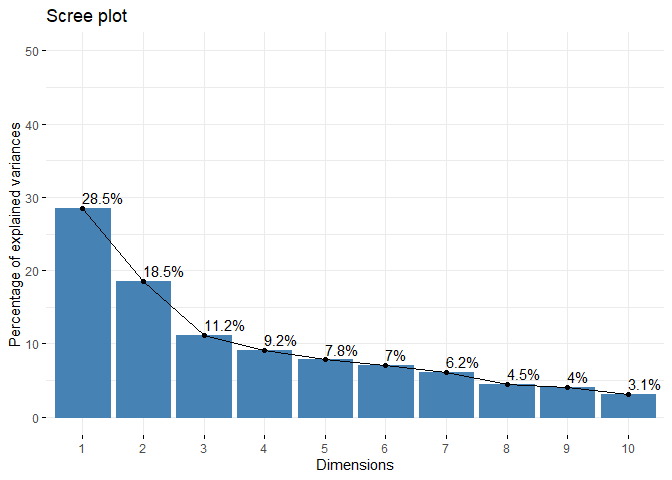
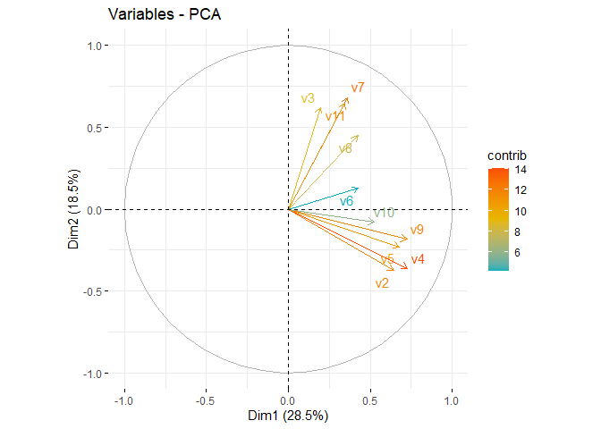
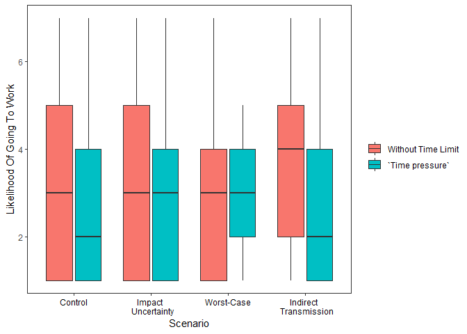
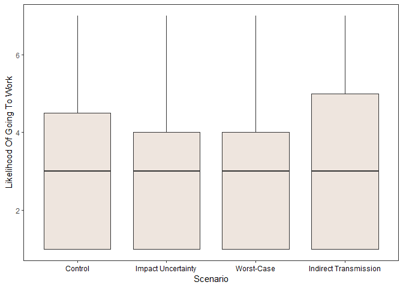
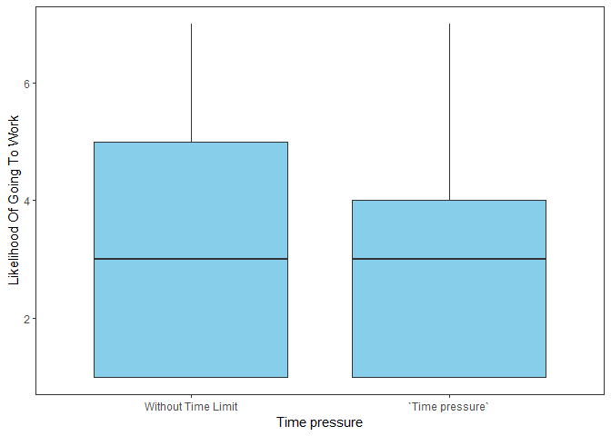
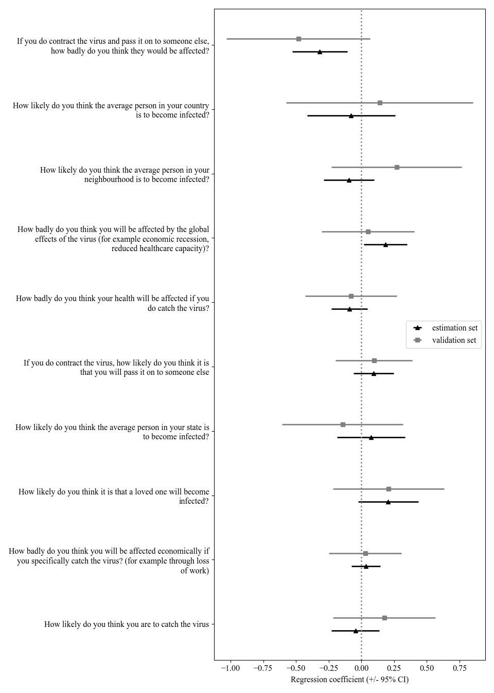

A dual process approach to prosocial behaviour
================
Nuno Fernandes
23/11/2021

### Import library

``` r
packages <- c("dplyr", "tibble", "tidyr", "purrr", "FactoMineR", "ggplot2", "lm.beta", "olsrr", "rcompanion", "FSA", "caret", "tidyverse", "reticulate", "factoextra", "MASS", "ggeffects", "effects", "rio", "foreign", "Hmisc","reshape2", "misty", "lavaan")

installed_packages <- packages %in% row.names(installed.packages())
if (any(installed_packages == FALSE)) {
  install.packages(packages[!installed.packages])
}

lapply(packages, library, character.only = TRUE)
```

### Read data

``` r
setwd("~/2021/Artigo_Covid-19_Daniela")
# import worksheets
data_list <- import_list("df_cooperation_covid.xlsx")
```

### Clean tarefa principal

``` r
# tarefa principal
main_task <- data_list$task
glimpse(main_task)

# rename dv
names(main_task)[which(names(main_task) == "Prosocial behavior")] <- "dv"

# `Time pressure` as factor
main_task$`Time pressure`<- factor(main_task$`Time pressure`, levels = c("0","1"))

# Scenario recode
main_task$Scenario[main_task$Scenario==1]<-"a"
main_task$Scenario[main_task$Scenario==2]<-"b"
main_task$Scenario[main_task$Scenario==3]<-"c"
main_task$Scenario[main_task$Scenario==4]<-"d"

# Scenario as factor
main_task$Scenario <- factor(main_task$Scenario, levels = c("a","b","c","d"))

# na.removal
main_task<- main_task[!is.na(main_task$dv), ]
main_task<- main_task[!is.na(main_task$`Time pressure`),]
main_task<- main_task[!is.na(main_task$Scenario),]
```

### Clean risk/probability discount & merge

``` r
# risk/probability discount 
data_list$Discount$R2 <- as.numeric(as.character(data_list$Discount$R2))

risk_tarefa <- data_list$`Discount`
main_task$AUC = risk_tarefa[match(main_task$Code, risk_tarefa$Code),"AUC"]

# rem outliers
yout = main_task$AUC < 0.07

#boxplot(main_task$AUC,
  #ylab = "AUC"
#)
```

### Clean SVO and merge

``` r
svo <- data_list$`svo task`
main_task$SVO = svo[match(main_task$Code, risk_tarefa$Code), "SVO"]
main_task$SVO <- as.factor(main_task$SVO)
```

### COVID\_Risk PCA

``` r
# covid risk questionnaire
covid<- data_list$` Subj Risk COVID-19`
covid<-na.omit(covid)

# rename col
colnames(covid)[2]<-"v1"
colnames(covid)[3]<-"v2"
colnames(covid)[4]<-"v3"
colnames(covid)[5]<-"v4"
colnames(covid)[6]<-"v5"
colnames(covid)[7]<-"v6"
colnames(covid)[8]<-"v7"
colnames(covid)[9]<-"v8"
colnames(covid)[10]<-"v9"
colnames(covid)[11]<-"v10"
colnames(covid)[12]<-"v11"
#names(covid)

#pca
pca <- PCA(covid[,3:12], graph=F)
summary(pca,nbelements = 10, ncp = 3)
```

    ## 
    ## Call:
    ## PCA(X = covid[, 3:12], graph = F) 
    ## 
    ## 
    ## Eigenvalues
    ##                        Dim.1   Dim.2   Dim.3   Dim.4   Dim.5   Dim.6   Dim.7
    ## Variance               2.851   1.848   1.119   0.915   0.783   0.702   0.616
    ## % of var.             28.506  18.481  11.193   9.151   7.830   7.020   6.162
    ## Cumulative % of var.  28.506  46.987  58.180  67.331  75.160  82.180  88.342
    ##                        Dim.8   Dim.9  Dim.10
    ## Variance               0.452   0.404   0.310
    ## % of var.              4.525   4.036   3.097
    ## Cumulative % of var.  92.867  96.903 100.000
    ## 
    ## Individuals (the 10 first)
    ##         Dist    Dim.1    ctr   cos2    Dim.2    ctr   cos2    Dim.3    ctr
    ## 1   |  5.644 | -1.849  0.395  0.107 |  2.104  0.788  0.139 | -3.409  3.415
    ## 3   |  2.769 | -1.756  0.356  0.402 | -0.432  0.033  0.024 |  0.659  0.127
    ## 4   |  2.781 |  0.225  0.006  0.007 |  0.742  0.098  0.071 |  1.683  0.833
    ## 5   |  2.603 |  1.313  0.199  0.255 | -0.858  0.131  0.109 |  0.524  0.081
    ## 6   |  2.551 |  0.242  0.007  0.009 |  0.193  0.007  0.006 |  0.302  0.027
    ## 7   |  4.018 | -1.572  0.285  0.153 |  0.982  0.172  0.060 |  0.051  0.001
    ## 8   |  4.691 | -3.141  1.139  0.448 | -0.098  0.002  0.000 | -2.201  1.424
    ## 9   |  1.612 |  0.140  0.002  0.008 |  0.614  0.067  0.145 |  0.814  0.195
    ## 10  |  4.005 | -2.034  0.477  0.258 | -2.252  0.903  0.316 |  0.245  0.018
    ## 11  |  2.127 |  0.383  0.017  0.032 |  1.179  0.247  0.307 | -0.914  0.245
    ##       cos2  
    ## 1    0.365 |
    ## 3    0.057 |
    ## 4    0.366 |
    ## 5    0.040 |
    ## 6    0.014 |
    ## 7    0.000 |
    ## 8    0.220 |
    ## 9    0.255 |
    ## 10   0.004 |
    ## 11   0.185 |
    ## 
    ## Variables
    ##        Dim.1    ctr   cos2    Dim.2    ctr   cos2    Dim.3    ctr   cos2  
    ## v2  |  0.644 14.541  0.415 | -0.376  7.650  0.141 | -0.424 16.045  0.180 |
    ## v3  |  0.195  1.329  0.038 |  0.620 20.766  0.384 | -0.370 12.219  0.137 |
    ## v4  |  0.728 18.567  0.529 | -0.362  7.074  0.131 | -0.331  9.799  0.110 |
    ## v5  |  0.678 16.103  0.459 | -0.229  2.840  0.052 |  0.321  9.205  0.103 |
    ## v6  |  0.427  6.404  0.183 |  0.127  0.873  0.016 |  0.338 10.225  0.114 |
    ## v7  |  0.363  4.611  0.131 |  0.682 25.199  0.466 |  0.064  0.366  0.004 |
    ## v8  |  0.424  6.303  0.180 |  0.449 10.889  0.201 | -0.008  0.005  0.000 |
    ## v9  |  0.724 18.368  0.524 | -0.185  1.855  0.034 | -0.169  2.539  0.028 |
    ## v10 |  0.522  9.576  0.273 | -0.079  0.337  0.006 |  0.663 39.278  0.440 |
    ## v11 |  0.346  4.198  0.120 |  0.645 22.517  0.416 | -0.060  0.319  0.004 |

``` r
get_eig(pca)
```

    ##        eigenvalue variance.percent cumulative.variance.percent
    ## Dim.1   2.8505802        28.505802                    28.50580
    ## Dim.2   1.8481388        18.481388                    46.98719
    ## Dim.3   1.1193057        11.193057                    58.18025
    ## Dim.4   0.9150509         9.150509                    67.33076
    ## Dim.5   0.7829536         7.829536                    75.16029
    ## Dim.6   0.7019508         7.019508                    82.17980
    ## Dim.7   0.6162239         6.162239                    88.34204
    ## Dim.8   0.4524525         4.524525                    92.86656
    ## Dim.9   0.4036499         4.036499                    96.90306
    ## Dim.10  0.3096936         3.096936                   100.00000

``` r
fviz_screeplot(pca, addlabels = TRUE, ylim = c(0, 50))
```

<!-- -->

``` r
var <- get_pca_var(pca)
head(var)
```

    ## $coord
    ##         Dim.1       Dim.2        Dim.3       Dim.4        Dim.5
    ## v2  0.6438271 -0.37600522 -0.423781890  0.06306370  0.121435959
    ## v3  0.1946506  0.61950969 -0.369819553 -0.09833257  0.072634060
    ## v4  0.7275079 -0.36157192 -0.331179215 -0.13015131  0.130882282
    ## v5  0.6775222 -0.22909933  0.320990962 -0.34921629 -0.099854413
    ## v6  0.4272560  0.12699278  0.338306259  0.72192382  0.351686385
    ## v7  0.3625381  0.68242989  0.063978314 -0.07309105  0.227879588
    ## v8  0.4238764  0.44859787 -0.007552867  0.24760304 -0.710235094
    ## v9  0.7235898 -0.18515894 -0.168593729  0.20027647 -0.155554820
    ## v10 0.5224581 -0.07894007  0.663050709 -0.24282037 -0.001212212
    ## v11 0.3459429  0.64509898 -0.059764515 -0.27498585  0.177721954
    ## 
    ## $cor
    ##         Dim.1       Dim.2        Dim.3       Dim.4        Dim.5
    ## v2  0.6438271 -0.37600522 -0.423781890  0.06306370  0.121435959
    ## v3  0.1946506  0.61950969 -0.369819553 -0.09833257  0.072634060
    ## v4  0.7275079 -0.36157192 -0.331179215 -0.13015131  0.130882282
    ## v5  0.6775222 -0.22909933  0.320990962 -0.34921629 -0.099854413
    ## v6  0.4272560  0.12699278  0.338306259  0.72192382  0.351686385
    ## v7  0.3625381  0.68242989  0.063978314 -0.07309105  0.227879588
    ## v8  0.4238764  0.44859787 -0.007552867  0.24760304 -0.710235094
    ## v9  0.7235898 -0.18515894 -0.168593729  0.20027647 -0.155554820
    ## v10 0.5224581 -0.07894007  0.663050709 -0.24282037 -0.001212212
    ## v11 0.3459429  0.64509898 -0.059764515 -0.27498585  0.177721954
    ## 
    ## $cos2
    ##          Dim.1       Dim.2        Dim.3       Dim.4        Dim.5
    ## v2  0.41451338 0.141379925 1.795911e-01 0.003977031 1.474669e-02
    ## v3  0.03788884 0.383792261 1.367665e-01 0.009669293 5.275707e-03
    ## v4  0.52926771 0.130734251 1.096797e-01 0.016939364 1.713017e-02
    ## v5  0.45903631 0.052486501 1.030352e-01 0.121952017 9.970904e-03
    ## v6  0.18254771 0.016127167 1.144511e-01 0.521174004 1.236833e-01
    ## v7  0.13143385 0.465710550 4.093225e-03 0.005342301 5.192911e-02
    ## v8  0.17967124 0.201240053 5.704581e-05 0.061307268 5.044339e-01
    ## v9  0.52358222 0.034283833 2.842385e-02 0.040110664 2.419730e-02
    ## v10 0.27296243 0.006231535 4.396362e-01 0.058961732 1.469458e-06
    ## v11 0.11967651 0.416152692 3.571797e-03 0.075617220 3.158509e-02
    ## 
    ## $contrib
    ##         Dim.1      Dim.2        Dim.3      Dim.4        Dim.5
    ## v2  14.541369  7.6498544 16.044864548  0.4346240 1.883469e+00
    ## v3   1.329162 20.7664201 12.218868923  1.0566946 6.738211e-01
    ## v4  18.567017  7.0738331  9.798901951  1.8511937 2.187891e+00
    ## v5  16.103259  2.8399654  9.205277326 13.3273480 1.273499e+00
    ## v6   6.403879  0.8726167 10.225188763 56.9557395 1.579702e+01
    ## v7   4.610775 25.1988951  0.365693169  0.5838256 6.632462e+00
    ## v8   6.302971 10.8887956  0.005096535  6.6998752 6.442704e+01
    ## v9  18.367567  1.8550464  2.539417469  4.3834353 3.090515e+00
    ## v10  9.575680  0.3371789 39.277583037  6.4435467 1.876813e-04
    ## v11  4.198321 22.5173942  0.319108279  8.2637174 4.034095e+00

``` r
fviz_pca_var(pca, col.var="contrib",
             gradient.cols = c("#00AFBB", "#E7B800", "#FC4E07"),
             repel = TRUE 
)
```

<!-- -->

### CFA COVID-19 scale

``` r
# cfa
model<-'
c1=~v2+v4+v9
c2=~v3+v7+v8+v11
c3=~v10+v5'
fit<- cfa(model, data=covid)
summary(fit, fit.measures=T,standardized=T)
```

    ## lavaan 0.6-8 ended normally after 49 iterations
    ## 
    ##   Estimator                                         ML
    ##   Optimization method                           NLMINB
    ##   Number of model parameters                        21
    ##                                                       
    ##   Number of observations                           304
    ##                                                       
    ## Model Test User Model:
    ##                                                       
    ##   Test statistic                                57.986
    ##   Degrees of freedom                                24
    ##   P-value (Chi-square)                           0.000
    ## 
    ## Model Test Baseline Model:
    ## 
    ##   Test statistic                               641.058
    ##   Degrees of freedom                                36
    ##   P-value                                        0.000
    ## 
    ## User Model versus Baseline Model:
    ## 
    ##   Comparative Fit Index (CFI)                    0.944
    ##   Tucker-Lewis Index (TLI)                       0.916
    ## 
    ## Loglikelihood and Information Criteria:
    ## 
    ##   Loglikelihood user model (H0)              -4429.097
    ##   Loglikelihood unrestricted model (H1)      -4400.104
    ##                                                       
    ##   Akaike (AIC)                                8900.194
    ##   Bayesian (BIC)                              8978.251
    ##   Sample-size adjusted Bayesian (BIC)         8911.650
    ## 
    ## Root Mean Square Error of Approximation:
    ## 
    ##   RMSEA                                          0.068
    ##   90 Percent confidence interval - lower         0.046
    ##   90 Percent confidence interval - upper         0.091
    ##   P-value RMSEA <= 0.05                          0.085
    ## 
    ## Standardized Root Mean Square Residual:
    ## 
    ##   SRMR                                           0.056
    ## 
    ## Parameter Estimates:
    ## 
    ##   Standard errors                             Standard
    ##   Information                                 Expected
    ##   Information saturated (h1) model          Structured
    ## 
    ## Latent Variables:
    ##                    Estimate  Std.Err  z-value  P(>|z|)   Std.lv  Std.all
    ##   c1 =~                                                                 
    ##     v2                1.000                               1.090    0.716
    ##     v4                1.110    0.100   11.130    0.000    1.210    0.878
    ##     v9                0.762    0.079    9.606    0.000    0.831    0.614
    ##   c2 =~                                                                 
    ##     v3                1.000                               1.008    0.480
    ##     v7                1.239    0.210    5.908    0.000    1.248    0.699
    ##     v8                0.631    0.127    4.971    0.000    0.636    0.433
    ##     v11               0.731    0.123    5.925    0.000    0.737    0.634
    ##   c3 =~                                                                 
    ##     v10               1.000                               0.367    0.491
    ##     v5                3.161    0.668    4.728    0.000    1.159    0.996
    ## 
    ## Covariances:
    ##                    Estimate  Std.Err  z-value  P(>|z|)   Std.lv  Std.all
    ##   c1 ~~                                                                 
    ##     c2                0.132    0.086    1.538    0.124    0.120    0.120
    ##     c3                0.208    0.054    3.864    0.000    0.520    0.520
    ##   c2 ~~                                                                 
    ##     c3                0.055    0.029    1.884    0.060    0.149    0.149
    ## 
    ## Variances:
    ##                    Estimate  Std.Err  z-value  P(>|z|)   Std.lv  Std.all
    ##    .v2                1.129    0.125    9.056    0.000    1.129    0.487
    ##    .v4                0.435    0.106    4.106    0.000    0.435    0.229
    ##    .v9                1.142    0.107   10.684    0.000    1.142    0.623
    ##    .v3                3.398    0.322   10.555    0.000    3.398    0.770
    ##    .v7                1.626    0.253    6.435    0.000    1.626    0.511
    ##    .v8                1.752    0.160   10.976    0.000    1.752    0.812
    ##    .v11               0.808    0.101    8.001    0.000    0.808    0.598
    ##    .v10               0.423    0.042    9.972    0.000    0.423    0.759
    ##    .v5                0.011    0.249    0.043    0.966    0.011    0.008
    ##     c1                1.189    0.185    6.437    0.000    1.000    1.000
    ##     c2                1.015    0.283    3.593    0.000    1.000    1.000
    ##     c3                0.134    0.039    3.483    0.000    1.000    1.000

### Merge COVID to main\_task

``` r
# dimensions 

covid$spread <- rowMeans(covid[,c("v2", "v4","v9")], na.rm=TRUE)

covid$impact <- rowMeans(covid[,c("v3", "v7", "v8", "v11")], na.rm=TRUE)

covid$distant_spread <- rowMeans(covid[,c("v10", "v5")], na.rm=TRUE)

covid$impact_to_other <- covid$v1

# merge to tarefa principal
names(covid)[1]<-"Code"

main_task$i1=covid[match(main_task$Code, covid$Code),"v1"]
main_task$i2=covid[match(main_task$Code, covid$Code),"v2"]
main_task$i3=covid[match(main_task$Code, covid$Code),"v3"]
main_task$i4=covid[match(main_task$Code, covid$Code),"v4"]
main_task$i5=covid[match(main_task$Code, covid$Code),"v5"]
main_task$i6=covid[match(main_task$Code, covid$Code),"v6"]
main_task$i7=covid[match(main_task$Code, covid$Code),"v7"]
main_task$i8=covid[match(main_task$Code, covid$Code),"v8"]
main_task$i9=covid[match(main_task$Code, covid$Code),"v9"]
main_task$i10=covid[match(main_task$Code, covid$Code),"v10"]
main_task$i11=covid[match(main_task$Code, covid$Code),"v11"]
main_task$i12=covid[match(main_task$Code, covid$Code),"v12"]


main_task$covid_spread = covid[match(main_task$Code, covid$Code),"spread"]
main_task$covid_impact = covid[match(main_task$Code, covid$Code), "impact"]
main_task$covid_distant_spread = covid[match(main_task$Code, covid$Code), "distant_spread"]
main_task$covid_impact_to_other = covid[match(main_task$Code, covid$Code), "impact_to_other"]
```

### IRI clean & merge

``` r
# IRI scale
IRI<- data_list$`IRI task`
#str(IRI)
names(IRI)[1]<-"Code"
#names(IRI)

# merge to tarefa principal 
main_task$iri_TP = IRI[match(main_task$Code, IRI$Code),"PT"]
main_task$iri_PE = IRI[match(main_task$Code, IRI$Code),"EC"]
main_task$iri_DP = IRI[match(main_task$Code, IRI$Code),"PD"]
main_task$iri_F = IRI[match(main_task$Code, IRI$Code),"F"]
#main_task$iri_E = IRI[match(main_task$Code, IRI$Code),"Empathy"]
```

### Preliminary Sociodemographics & merge

``` r
# sociodemographic data 
sociodemog<-data_list$`Socio-demographic `
#names(sociodemog)
names(sociodemog)[1]<-"Code"

# merge to tarefa principal
main_task$age = sociodemog[match(main_task$Code, IRI$Code),"Age"]
main_task$gender = sociodemog[match(main_task$Code, IRI$Code),"Gender"]
main_task$socioeconomic= sociodemog[match(main_task$Code, sociodemog$Code), "SES"]
main_task$education = sociodemog[match(main_task$Code, sociodemog$Code), "Educational Qualifications"]
main_task$job = sociodemog[match(main_task$Code, sociodemog$Code),"Profession"]

# as.factor                                        
main_task$gender<-factor(main_task$gender)
main_task$socioeconomic <- factor(main_task$socioeconomic)
main_task$education <- factor(main_task$education)
main_task$job <- factor(main_task$job)
main_task$phase<-factor(main_task$Phase)
```

### Exploratory plots

### Interaction

``` r
xlabs <- c("Control", "Impact \n  Uncertainty", "Worst-Case", "Indirect \n  Transmission")

ggplot(data=main_task,                     
       aes(x=Scenario, 
           y=dv, 
           fill=`Time pressure`)) +                       
  geom_boxplot() +                            
  labs(y='Likelihood Of Going To Work') + xlab("Scenario") +                
  theme_bw() + 
    scale_x_discrete(labels= xlabs) +   
  theme(axis.text.x = element_text(color = "black")) +
  #removing legend title and renaming labels
  scale_fill_discrete(name="",
         labels=c("Without Time Limit","`Time pressure`")) + 
   theme(panel.grid.major = element_blank(), panel.grid.minor = element_blank())
```

<!-- -->

### Scenario

``` r
#create x labels
xlabs <- c("Control", "Impact Uncertainty", "Worst-Case","Indirect Transmission")

ggplot(data=main_task,                     
       aes(x=Scenario, 
           y=dv)) +                       
  geom_boxplot(fill="seashell2") +                      
  labs(y='Likelihood Of Going To Work') + xlab("Scenario") +
   theme(axis.text.x = element_text(color = "black")) +
    theme_bw() + 
  theme(panel.grid.major = element_blank(), panel.grid.minor = element_blank()) + 
  scale_x_discrete(labels= xlabs) +  
  theme(axis.text.x = element_text(color = "black"))
```

<!-- -->

### Time pressure

``` r
xlabs<-c("Without Time Limit","`Time pressure`")

ggplot(data=main_task,                     
       aes(x=`Time pressure`, 
           y=dv)) +                       
  geom_boxplot(fill = "SKYblue") +
  labs(y='Likelihood Of Going To Work') +
  theme(panel.grid.major = element_blank(), panel.grid.minor = element_blank()) + 
    scale_x_discrete(labels= xlabs) +
  theme(axis.text.x = element_text(color = "black")) + 
  theme_bw() + 
   theme(panel.grid.major = element_blank(), panel.grid.minor = element_blank())
```

<!-- -->

## Statistical Analysis

### preprocessing

``` r
main_task$dv_factor<-factor(main_task$dv, ordered = T)
#colnames(main_task)
#main_task_2<-main_task[, c(1,2,3,18,25,37,38,39,40,41,42,43,44,45,46,47,48,49,50,51,52)]


main_task_2<-main_task[, c("Code","Time pressure","Scenario","dv","Phase","AUC","i1","i2","i3","i4","i5","i6","i7","i8","i9","i10", "i11", "covid_spread", "covid_impact", "covid_distant_spread","covid_impact_to_other", "iri_TP", "iri_PE", "iri_DP","iri_F","age", "gender", "socioeconomic", "education", "job", "phase", "dv_factor")]
main_task_2_na.rem<- na.omit(main_task_2)

#collapse education levels, since there were only 3 participants below 9th grade afert na's removal

#highschool_or_below
main_task_2_na.rem$education[main_task_2_na.rem$education==2]<-"2"
main_task_2_na.rem$education[main_task_2_na.rem$education==3]<-"2"
main_task_2_na.rem$education[main_task_2_na.rem$education==4]<-"2"

#bachelor_or_higher
main_task_2_na.rem$education[main_task_2_na.rem$education==5]<-"3"
main_task_2_na.rem$education[main_task_2_na.rem$education==6]<-"3"
main_task_2_na.rem$education[main_task_2_na.rem$education==7]<-"3"

#collapse low and moderate/low socioeconomic levels, since there were only 5 participants with low socioeconomic levels

main_task_2_na.rem$socioeconomic[main_task_2_na.rem$socioeconomic==1]<-"1"
main_task_2_na.rem$socioeconomic[main_task_2_na.rem$socioeconomic==2]<-"1"
main_task_2_na.rem$socioeconomic[main_task_2_na.rem$socioeconomic==3]<-"2"
main_task_2_na.rem$socioeconomic[main_task_2_na.rem$socioeconomic==4]<-"3"

main_task_2_na.rem$job[main_task_2_na.rem$job==1]<-"1"
main_task_2_na.rem$job[main_task_2_na.rem$job==2]<-"2"
main_task_2_na.rem$job[main_task_2_na.rem$job==3]<-"3"
main_task_2_na.rem$job[main_task_2_na.rem$job==4]<-"4"
main_task_2_na.rem$job[main_task_2_na.rem$job==6]<-"6"

#SVO for ORDINAL LR
main_task_3 <- main_task[, c("Code","Time pressure","Scenario","dv","Phase","AUC","i1","i2","i3","i4","i5","i6","i7","i8","i9","i10", "i11", "covid_spread", "covid_impact", "covid_distant_spread","covid_impact_to_other", "iri_TP", "iri_PE", "iri_DP","iri_F","age", "gender", "socioeconomic", "education", "job", "phase", "dv_factor", "SVO")]

main_task_3_na.rem<-na.omit(main_task_3)
```

### fit model (dv \~ `Time pressure`\*Scenario + phase)

``` r
data_olr <- main_task[, c("Time pressure", "Scenario", "phase", "dv_factor")]
#data_olr$phase <- data_olr$Phase

m10<- polr(dv_factor ~`Time pressure` + Scenario + phase, data= data_olr, Hess=TRUE)
summary(m10)
```

    ## Call:
    ## polr(formula = dv_factor ~ `Time pressure` + Scenario + phase, 
    ##     data = data_olr, Hess = TRUE)
    ## 
    ## Coefficients:
    ##                      Value Std. Error   t value
    ## `Time pressure`1 -0.501007     0.1621 -3.090680
    ## Scenariob        -0.017725     0.2284 -0.077600
    ## Scenarioc        -0.001575     0.2205 -0.007144
    ## Scenariod         0.192900     0.2292  0.841561
    ## phase2            0.196113     0.1661  1.180581
    ## 
    ## Intercepts:
    ##     Value   Std. Error t value
    ## 1|2 -0.9954  0.1919    -5.1875
    ## 2|3 -0.4060  0.1879    -2.1604
    ## 3|4  0.2667  0.1878     1.4202
    ## 4|5  1.0921  0.1946     5.6122
    ## 5|6  2.3420  0.2296    10.2000
    ## 6|7  2.8336  0.2580    10.9836
    ## 
    ## Residual Deviance: 1749.19 
    ## AIC: 1771.19

``` r
ctable <- coef(summary(m10))
p <- pnorm(abs(ctable[, "t value"]), lower.tail = F) * 2
ctable <- cbind(ctable, "p value" = p)
ctable
```

    ##                         Value Std. Error      t value      p value
    ## `Time pressure`1 -0.501007055  0.1621025 -3.090679909 1.996988e-03
    ## Scenariob        -0.017724753  0.2284108 -0.077600334 9.381460e-01
    ## Scenarioc        -0.001575202  0.2204951 -0.007143932 9.943000e-01
    ## Scenariod         0.192899913  0.2292169  0.841560642 4.000339e-01
    ## phase2            0.196113089  0.1661157  1.180581141 2.377692e-01
    ## 1|2              -0.995415768  0.1918869 -5.187512797 2.131213e-07
    ## 2|3              -0.405954894  0.1879105 -2.160362457 3.074462e-02
    ## 3|4               0.266720308  0.1878060  1.420190412 1.555523e-01
    ## 4|5               1.092118579  0.1945963  5.612225465 1.997409e-08
    ## 5|6               2.341988421  0.2296067 10.199999959 1.982726e-24
    ## 6|7               2.833587719  0.2579835 10.983599400 4.582919e-28

``` r
ci <- confint(m10)
exp(cbind(OR = coef(m10), ci))
```

    ##                         OR     2.5 %    97.5 %
    ## `Time pressure`1 0.6059202 0.4405089 0.8318523
    ## Scenariob        0.9824314 0.6276369 1.5375895
    ## Scenarioc        0.9984260 0.6479737 1.5388396
    ## Scenariod        1.2127614 0.7739961 1.9021276
    ## phase2           1.2166645 0.8784594 1.6852592

### Ordinal Logistic Regression (other variables) 254 participants

``` r
m <- polr(dv_factor ~  AUC + covid_distant_spread + covid_impact_to_other + covid_spread + covid_impact + iri_TP + iri_PE + iri_DP + iri_F + age + gender + socioeconomic, data= main_task_2_na.rem, Hess=TRUE)
summary(m)
```

    ## Call:
    ## polr(formula = dv_factor ~ AUC + covid_distant_spread + covid_impact_to_other + 
    ##     covid_spread + covid_impact + iri_TP + iri_PE + iri_DP + 
    ##     iri_F + age + gender + socioeconomic, data = main_task_2_na.rem, 
    ##     Hess = TRUE)
    ## 
    ## Coefficients:
    ##                           Value Std. Error t value
    ## AUC                    0.902449    0.54063  1.6692
    ## covid_distant_spread   0.048828    0.14767  0.3306
    ## covid_impact_to_other -0.064679    0.09972 -0.6486
    ## covid_spread           0.174768    0.10559  1.6551
    ## covid_impact          -0.214316    0.10542 -2.0330
    ## iri_TP                 0.051283    0.03383  1.5161
    ## iri_PE                -0.011504    0.04797 -0.2398
    ## iri_DP                -0.054716    0.02992 -1.8289
    ## iri_F                 -0.003341    0.02655 -0.1259
    ## age                   -0.043080    0.02018 -2.1345
    ## gender2                0.408522    0.37307  1.0950
    ## socioeconomic2        -0.507132    0.28745 -1.7642
    ## socioeconomic3        -0.776211    0.38366 -2.0232
    ## 
    ## Intercepts:
    ##     Value   Std. Error t value
    ## 1|2 -2.2320  1.6868    -1.3232
    ## 2|3 -1.5661  1.6832    -0.9305
    ## 3|4 -0.8490  1.6782    -0.5059
    ## 4|5  0.2018  1.6754     0.1204
    ## 5|6  2.0553  1.6923     1.2145
    ## 6|7  2.9799  1.7277     1.7248
    ## 
    ## Residual Deviance: 850.3369 
    ## AIC: 888.3369

``` r
ctable <- coef(summary(m))
p <- pnorm(abs(ctable[, "t value"]), lower.tail = FALSE) * 2
ctable <- cbind(ctable, "p value" = p)
ctable
```

    ##                              Value Std. Error    t value    p value
    ## AUC                    0.902448579 0.54063481  1.6692388 0.09507007
    ## covid_distant_spread   0.048827565 0.14767486  0.3306424 0.74091464
    ## covid_impact_to_other -0.064679196 0.09971904 -0.6486143 0.51658769
    ## covid_spread           0.174767808 0.10559159  1.6551300 0.09789813
    ## covid_impact          -0.214316127 0.10541693 -2.0330332 0.04204917
    ## iri_TP                 0.051282563 0.03382602  1.5160686 0.12950200
    ## iri_PE                -0.011504193 0.04797128 -0.2398142 0.81047430
    ## iri_DP                -0.054715895 0.02991683 -1.8289336 0.06740955
    ## iri_F                 -0.003341257 0.02654773 -0.1258585 0.89984394
    ## age                   -0.043080258 0.02018252 -2.1345331 0.03279917
    ## gender2                0.408521587 0.37307108  1.0950234 0.27350636
    ## socioeconomic2        -0.507132154 0.28745050 -1.7642417 0.07769129
    ## socioeconomic3        -0.776211197 0.38366176 -2.0231654 0.04305610
    ## 1|2                   -2.231968025 1.68679572 -1.3232000 0.18576889
    ## 2|3                   -1.566138829 1.68315813 -0.9304763 0.35212450
    ## 3|4                   -0.848966240 1.67823952 -0.5058671 0.61294992
    ## 4|5                    0.201768810 1.67541350  0.1204293 0.90414311
    ## 5|6                    2.055262224 1.69226886  1.2145010 0.22455647
    ## 6|7                    2.979883060 1.72771645  1.7247524 0.08457211

``` r
#ci <- confint(m)
exp(cbind("Odds ratio" = coef(m), confint.default(m, level = 0.95)))
```

    ##                       Odds ratio     2.5 %    97.5 %
    ## AUC                    2.4656330 0.8545535 7.1140616
    ## covid_distant_spread   1.0500393 0.7861483 1.4025121
    ## covid_impact_to_other  0.9373681 0.7709553 1.1397017
    ## covid_spread           1.1909697 0.9683246 1.4648070
    ## covid_impact           0.8070932 0.6564364 0.9923269
    ## iri_TP                 1.0526203 0.9850970 1.1247720
    ## iri_PE                 0.9885617 0.8998509 1.0860180
    ## iri_DP                 0.9467541 0.8928365 1.0039277
    ## iri_F                  0.9966643 0.9461314 1.0498962
    ## age                    0.9578345 0.9206850 0.9964830
    ## gender2                1.5045917 0.7242024 3.1259164
    ## socioeconomic2         0.6022202 0.3428286 1.0578732
    ## socioeconomic3         0.4601461 0.2169313 0.9760437

``` r
#exp(coef(m))
```

### kruskal-wallis

``` r
#8 conditions (Scenario*`Time pressure`)
dataset <- mutate(main_task_2_na.rem,
        newvar = case_when(
                Scenario ==  "a" & `Time pressure`== "0" ~  1, 
                Scenario ==  "b" & `Time pressure`== "0" ~  2,
                Scenario ==  "c" & `Time pressure`== "0" ~  3,
                Scenario ==  "d" & `Time pressure`== "0" ~  4,
                Scenario ==  "a" & `Time pressure`== "1" ~  5,
                Scenario ==  "b" & `Time pressure`== "1" ~  6,
                Scenario ==  "c" & `Time pressure`== "1" ~  7,
                Scenario ==  "d" & `Time pressure`== "1" ~  8,
               TRUE ~ NA_real_ # This is for all other values 
             ))                    # not covered by the above.

dataset$newvar<- factor(dataset$newvar)

#Differences for each variable between experimental conditions


fit <- lapply(dataset[,c("covid_impact_to_other", "gender", "education", "socioeconomic")], function(y) kruskal.test(y ~ newvar, data = dataset))
fit
```

    ## $covid_impact_to_other
    ## 
    ##  Kruskal-Wallis rank sum test
    ## 
    ## data:  y by newvar
    ## Kruskal-Wallis chi-squared = 13.602, df = 7, p-value = 0.05873
    ## 
    ## 
    ## $gender
    ## 
    ##  Kruskal-Wallis rank sum test
    ## 
    ## data:  y by newvar
    ## Kruskal-Wallis chi-squared = 9.9538, df = 7, p-value = 0.1912
    ## 
    ## 
    ## $education
    ## 
    ##  Kruskal-Wallis rank sum test
    ## 
    ## data:  y by newvar
    ## Kruskal-Wallis chi-squared = 6.2241, df = 7, p-value = 0.5138
    ## 
    ## 
    ## $socioeconomic
    ## 
    ##  Kruskal-Wallis rank sum test
    ## 
    ## data:  y by newvar
    ## Kruskal-Wallis chi-squared = 15.342, df = 7, p-value = 0.03186

### Kruskal-wallis for SVO

``` r
dataset2 <- mutate(main_task_3_na.rem,
        newvar = case_when(
                Scenario ==  "a" & `Time pressure`== "0" ~  1, 
                Scenario ==  "b" & `Time pressure`== "0" ~  2,
                Scenario ==  "c" & `Time pressure`== "0" ~  3,
                Scenario ==  "d" & `Time pressure`== "0" ~  4,
                Scenario ==  "a" & `Time pressure`== "1" ~  5,
                Scenario ==  "b" & `Time pressure`== "1" ~  6,
                Scenario ==  "c" & `Time pressure`== "1" ~  7,
                Scenario ==  "d" & `Time pressure`== "1" ~  8,
               TRUE ~ NA_real_ # This is for all other values 
             ))                    # not covered by the above.

kruskal.test(SVO~newvar, data = dataset2)
```

    ## 
    ##  Kruskal-Wallis rank sum test
    ## 
    ## data:  SVO by newvar
    ## Kruskal-Wallis chi-squared = 10.199, df = 7, p-value = 0.1776

### Dunn post-hoc with bonferroni correction

``` r
#post-hoc socioeconomic
dataset$socioeconomic<- as.numeric(dataset$socioeconomic)
fit2<- dunnTest(dataset$socioeconomic~dataset$newvar, method = dunn.test::p.adjustment.methods[c(4,
  2:3, 5:8, 1)])
fit2 
```

    ## Dunn (1964) Kruskal-Wallis multiple comparison

    ##   p-values adjusted with the Holm method.

    ##    Comparison           Z    P.unadj     P.adj
    ## 1       1 - 2 -0.69972065 0.48410178 1.0000000
    ## 2       1 - 3 -1.78812505 0.07375583 1.0000000
    ## 3       2 - 3 -1.04067667 0.29802563 1.0000000
    ## 4       1 - 4 -0.40435075 0.68595481 1.0000000
    ## 5       2 - 4  0.30102543 0.76339510 1.0000000
    ## 6       3 - 4  1.37117470 0.17032050 1.0000000
    ## 7       1 - 5 -2.44270911 0.01457748 0.4081695
    ## 8       2 - 5 -1.77715291 0.07554309 1.0000000
    ## 9       3 - 5 -0.88938763 0.37379479 1.0000000
    ## 10      4 - 5 -2.07535099 0.03795402 0.9108964
    ## 11      1 - 6  0.21923136 0.82646983 1.0000000
    ## 12      2 - 6  0.83935120 0.40127226 1.0000000
    ## 13      3 - 6  1.80014694 0.07183744 1.0000000
    ## 14      4 - 6  0.57791696 0.56332018 1.0000000
    ## 15      5 - 6  2.41130595 0.01589551 0.4132832
    ## 16      1 - 7 -1.93025199 0.05357562 1.0000000
    ## 17      2 - 7 -1.25619784 0.20904425 1.0000000
    ## 18      3 - 7 -0.32923783 0.74197593 1.0000000
    ## 19      4 - 7 -1.55493728 0.11996101 1.0000000
    ## 20      5 - 7  0.51996422 0.60308851 1.0000000
    ## 21      6 - 7 -1.94465503 0.05181651 1.0000000
    ## 22      1 - 8 -2.43594813 0.01485281 0.4010260
    ## 23      2 - 8 -1.77829636 0.07535519 1.0000000
    ## 24      3 - 8 -0.90056964 0.36781718 1.0000000
    ## 25      4 - 8 -2.07283044 0.03818806 0.8783254
    ## 26      5 - 8 -0.01981192 0.98419341 0.9841934
    ## 27      6 - 8 -2.40790476 0.01604437 0.4011091
    ## 28      7 - 8 -0.53482260 0.59277253 1.0000000

### Anova

``` r
#Differences for each variable between experimental conditions

fit <- lapply(dataset[,c("age", "AUC","covid_distant_spread", "covid_spread", "covid_impact", "iri_TP", "iri_PE", "iri_DP", "iri_F")], function(y) summary(aov(y ~ Scenario, data = dataset)))

fit
```

    ## $age
    ##              Df Sum Sq Mean Sq F value Pr(>F)
    ## Scenario      3     70   23.49   0.539  0.656
    ## Residuals   250  10903   43.61               
    ## 
    ## $AUC
    ##              Df Sum Sq Mean Sq F value Pr(>F)
    ## Scenario      3  0.039 0.01289   0.271  0.846
    ## Residuals   250 11.884 0.04753               
    ## 
    ## $covid_distant_spread
    ##              Df Sum Sq Mean Sq F value Pr(>F)
    ## Scenario      3    2.5  0.8326   1.265  0.287
    ## Residuals   250  164.6  0.6584               
    ## 
    ## $covid_spread
    ##              Df Sum Sq Mean Sq F value Pr(>F)
    ## Scenario      3    2.4   0.784   0.563   0.64
    ## Residuals   250  347.8   1.391               
    ## 
    ## $covid_impact
    ##              Df Sum Sq Mean Sq F value Pr(>F)
    ## Scenario      3   6.62   2.208   1.751  0.157
    ## Residuals   250 315.28   1.261               
    ## 
    ## $iri_TP
    ##              Df Sum Sq Mean Sq F value Pr(>F)
    ## Scenario      3     31   10.45   0.804  0.493
    ## Residuals   250   3250   13.00               
    ## 
    ## $iri_PE
    ##              Df Sum Sq Mean Sq F value Pr(>F)
    ## Scenario      3   15.8   5.263    0.66  0.578
    ## Residuals   250 1994.5   7.978               
    ## 
    ## $iri_DP
    ##              Df Sum Sq Mean Sq F value Pr(>F)
    ## Scenario      3     91   30.21   1.651  0.178
    ## Residuals   250   4575   18.30               
    ## 
    ## $iri_F
    ##              Df Sum Sq Mean Sq F value Pr(>F)
    ## Scenario      3     72   24.06   0.984  0.401
    ## Residuals   250   6110   24.44

### OLR Plot

``` python
import pandas as pd 
import seaborn as sns 
import matplotlib as plt
from sklearn.ensemble import RandomForestClassifier
from sklearn.svm import SVC
from sklearn import svm
from sklearn.neural_network import MLPClassifier
from sklearn.metrics import confusion_matrix, classification_report
from sklearn.preprocessing import StandardScaler, LabelEncoder
from sklearn.model_selection import train_test_split
from sklearn.preprocessing import scale 
from sklearn import decomposition
from matplotlib import pyplot as plt
import plotly.express as px
import numpy as np
from sklearn.model_selection import cross_val_score, StratifiedKFold, KFold
from sklearn.linear_model import LogisticRegression
from sklearn.metrics import accuracy_score
from sklearn.model_selection import GridSearchCV
import statsmodels.formula.api as smf
import textwrap
import scipy.stats as stats
```

``` python
predict, validate = train_test_split(df, test_size=0.2, random_state=42)
```

``` python
mod = smf.ols(formula='dv ~ i2 + i3 + i4 + i5 + i6 + i7 + i8 + i9 + i10+i11', data=df)

fit = mod.fit()
fit.summary()
```

    ## <class 'statsmodels.iolib.summary.Summary'>
    ## """
    ##                             OLS Regression Results                            
    ## ==============================================================================
    ## Dep. Variable:                     dv   R-squared:                       0.111
    ## Model:                            OLS   Adj. R-squared:                  0.076
    ## Method:                 Least Squares   F-statistic:                     3.149
    ## Date:                Fri, 03 Dec 2021   Prob (F-statistic):           0.000816
    ## Time:                        11:29:47   Log-Likelihood:                -486.44
    ## No. Observations:                 262   AIC:                             994.9
    ## Df Residuals:                     251   BIC:                             1034.
    ## Df Model:                          10                                         
    ## Covariance Type:            nonrobust                                         
    ## ==============================================================================
    ##                  coef    std err          t      P>|t|      [0.025      0.975]
    ## ------------------------------------------------------------------------------
    ## Intercept      3.7286      1.002      3.722      0.000       1.756       5.701
    ## i2            -0.0017      0.083     -0.020      0.984      -0.164       0.161
    ## i3             0.0244      0.051      0.480      0.632      -0.076       0.125
    ## i4             0.1947      0.102      1.916      0.056      -0.005       0.395
    ## i5             0.0484      0.112      0.433      0.666      -0.172       0.269
    ## i6             0.0810      0.067      1.200      0.231      -0.052       0.214
    ## i7            -0.0740      0.064     -1.150      0.251      -0.201       0.053
    ## i8             0.1062      0.074      1.444      0.150      -0.039       0.251
    ## i9            -0.0227      0.090     -0.252      0.801      -0.200       0.155
    ## i10           -0.0439      0.151     -0.291      0.771      -0.341       0.253
    ## i11           -0.3886      0.098     -3.958      0.000      -0.582      -0.195
    ## ==============================================================================
    ## Omnibus:                       37.951   Durbin-Watson:                   2.018
    ## Prob(Omnibus):                  0.000   Jarque-Bera (JB):               10.044
    ## Skew:                           0.058   Prob(JB):                      0.00659
    ## Kurtosis:                       2.048   Cond. No.                         176.
    ## ==============================================================================
    ## 
    ## Notes:
    ## [1] Standard Errors assume that the covariance matrix of the errors is correctly specified.
    ## """

``` python
mod_discovery = smf.ols(formula='dv ~ i2 + i3 + i4 + i5 + i6 + i7 + i8 + i9 + i10 + i11', data=predict)

res_discovery = mod_discovery.fit()
res_discovery.summary()
```

    ## <class 'statsmodels.iolib.summary.Summary'>
    ## """
    ##                             OLS Regression Results                            
    ## ==============================================================================
    ## Dep. Variable:                     dv   R-squared:                       0.107
    ## Model:                            OLS   Adj. R-squared:                  0.060
    ## Method:                 Least Squares   F-statistic:                     2.287
    ## Date:                Fri, 03 Dec 2021   Prob (F-statistic):             0.0149
    ## Time:                        11:29:47   Log-Likelihood:                -367.27
    ## No. Observations:                 202   AIC:                             756.5
    ## Df Residuals:                     191   BIC:                             792.9
    ## Df Model:                          10                                         
    ## Covariance Type:            nonrobust                                         
    ## ==============================================================================
    ##                  coef    std err          t      P>|t|      [0.025      0.975]
    ## ------------------------------------------------------------------------------
    ## Intercept      3.3512      1.062      3.155      0.002       1.256       5.447
    ## i2            -0.0463      0.092     -0.503      0.616      -0.228       0.135
    ## i3             0.0325      0.056      0.583      0.561      -0.077       0.142
    ## i4             0.2047      0.117      1.750      0.082      -0.026       0.435
    ## i5             0.0717      0.132      0.544      0.587      -0.188       0.332
    ## i6             0.0938      0.077      1.212      0.227      -0.059       0.247
    ## i7            -0.0917      0.070     -1.305      0.193      -0.230       0.047
    ## i8             0.1835      0.084      2.191      0.030       0.018       0.349
    ## i9            -0.0949      0.097     -0.975      0.331      -0.287       0.097
    ## i10           -0.0798      0.170     -0.468      0.640      -0.416       0.256
    ## i11           -0.3195      0.107     -2.991      0.003      -0.530      -0.109
    ## ==============================================================================
    ## Omnibus:                       15.072   Durbin-Watson:                   2.191
    ## Prob(Omnibus):                  0.001   Jarque-Bera (JB):                6.388
    ## Skew:                           0.171   Prob(JB):                       0.0410
    ## Kurtosis:                       2.199   Cond. No.                         170.
    ## ==============================================================================
    ## 
    ## Notes:
    ## [1] Standard Errors assume that the covariance matrix of the errors is correctly specified.
    ## """

``` python
names = ['How likely do you think you are to catch the virus','How badly do you think you will be affected economically if you specifically catch the virus? (for example through loss of work)','How likely do you think it is that a loved one will become infected?','How likely do you think the average person in your state is to become infected?','If you do contract the virus, how likely do you think it is that you will pass it on to someone else','How badly do you think your health will be affected if you do catch the virus?','How badly do you think you will be affected by the global effects of the virus (for example economic recession, reduced healthcare capacity)?','How likely do you think the average person in your neighbourhood is to become infected?','How likely do you think the average person in your country is to become infected?','If you do contract the virus and pass it on to someone else, how badly do you think they would be affected?']


# font type & size
plt.rcParams.update({'font.size': 12})
plt.rcParams["font.family"] = "Times New Roman"

fig, ax = plt.subplots(figsize=(10,14))
fig.set_tight_layout(True)

# DISCOVERY
ax.axvline(0, linestyle=':', color='gray', linewidth=2)

# Points and error bars
ax.errorbar(y=np.arange(len(res_discovery.params[1:])) - 0.1, x=res_discovery.params[1:], 
             xerr=np.abs(res_discovery.conf_int().values[1:, :] - res_discovery.params[1:, np.newaxis]).T, 
             color='black', linewidth=2, fmt='^', label='estimation set')
```

    ## <ErrorbarContainer object of 3 artists>
    ## 
    ## <string>:2: FutureWarning: Support for multi-dimensional indexing (e.g. `obj[:, None]`) is deprecated and will be removed in a future version.  Convert to a numpy array before indexing instead.

``` python
ax.errorbar(y=np.arange(len(res_validation.params[1:])) + 0.1, x=res_validation.params[1:], 
             xerr=np.abs(res_validation.conf_int().values[1:, :] - res_validation.params[1:, np.newaxis]).T, 
             color='gray', linewidth=2, fmt='s', label='validation set')

# Labels
```

    ## <ErrorbarContainer object of 3 artists>
    ## 
    ## <string>:2: FutureWarning: Support for multi-dimensional indexing (e.g. `obj[:, None]`) is deprecated and will be removed in a future version.  Convert to a numpy array before indexing instead.

``` python
ax.set_yticks(range(len(names)))
```

    ## [<matplotlib.axis.YTick object at 0x000000006A7076A0>, <matplotlib.axis.YTick object at 0x000000006A6F1EE0>, <matplotlib.axis.YTick object at 0x000000006A6F12E0>, <matplotlib.axis.YTick object at 0x000000006A8866D0>, <matplotlib.axis.YTick object at 0x000000006A86B430>, <matplotlib.axis.YTick object at 0x000000006A8A04C0>, <matplotlib.axis.YTick object at 0x000000006A8A0C10>, <matplotlib.axis.YTick object at 0x000000006A8A53A0>, <matplotlib.axis.YTick object at 0x000000006A8A5AF0>, <matplotlib.axis.YTick object at 0x000000006A8A53D0>]

``` python
ax.set_yticklabels(['\n'.join(textwrap.wrap(q, 60, break_long_words=False)) for q in names])

## Titles 
```

    ## [Text(0, 0, 'How likely do you think you are to catch the virus'), Text(0, 1, 'How badly do you think you will be affected economically if\nyou specifically catch the virus? (for example through loss\nof work)'), Text(0, 2, 'How likely do you think it is that a loved one will become\ninfected?'), Text(0, 3, 'How likely do you think the average person in your state is\nto become infected?'), Text(0, 4, 'If you do contract the virus, how likely do you think it is\nthat you will pass it on to someone else'), Text(0, 5, 'How badly do you think your health will be affected if you\ndo catch the virus?'), Text(0, 6, 'How badly do you think you will be affected by the global\neffects of the virus (for example economic recession,\nreduced healthcare capacity)?'), Text(0, 7, 'How likely do you think the average person in your\nneighbourhood is to become infected?'), Text(0, 8, 'How likely do you think the average person in your country\nis to become infected?'), Text(0, 9, 'If you do contract the virus and pass it on to someone else,\nhow badly do you think they would be affected?')]

``` python
ax.set_xlabel('Regression coefficient (+/- 95% CI)')
ax.legend(loc=7)

plt.show()

##save
```



``` python
from PIL import Image
from io import BytesIO
# (1) save the image in memory in tiff format
png1 = BytesIO()
fig.savefig(png1, format= 'png')

# (2) load this image into PIL
png2 = Image.open(png1)

# (3) save as TIFF
png2.save('glm_Daniela_graph3.tiff')
png1.close()
```
